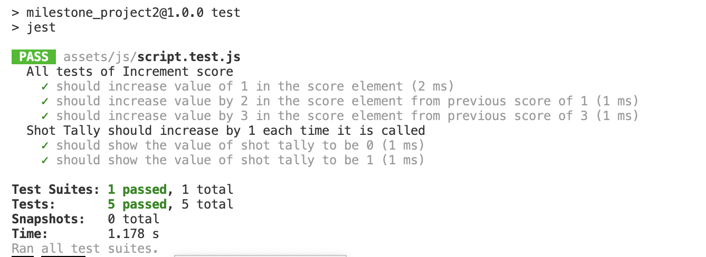
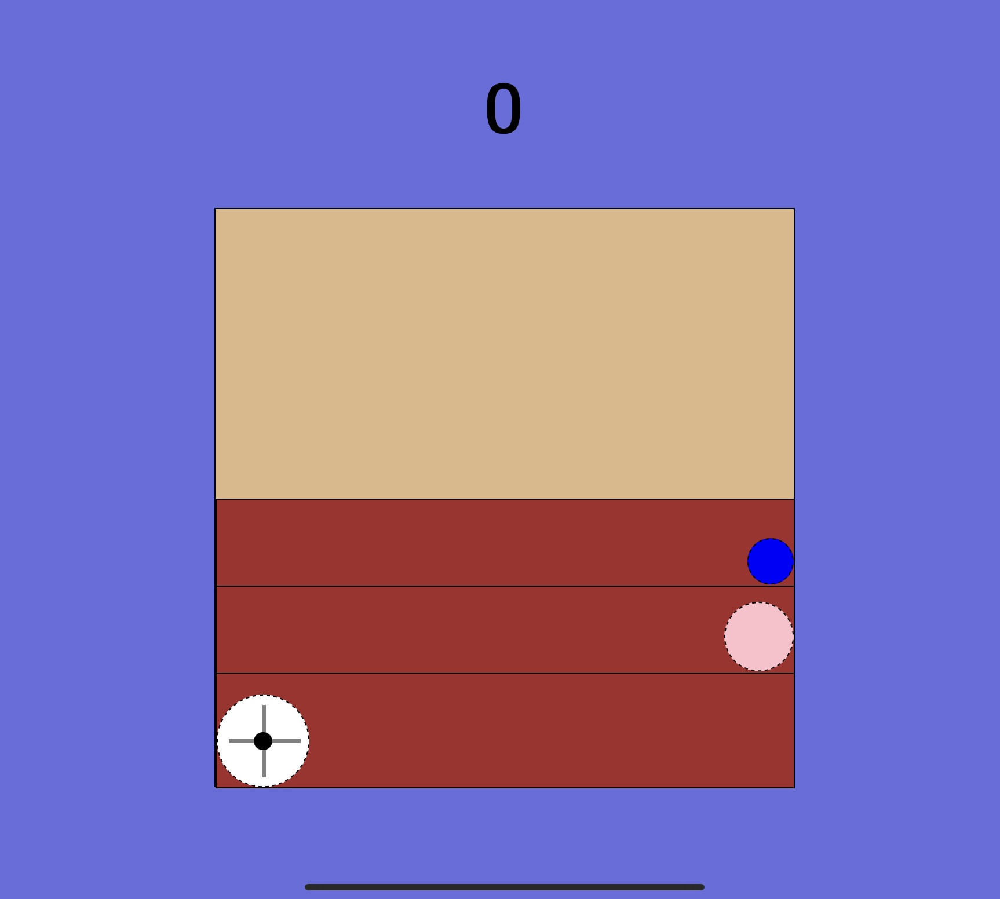
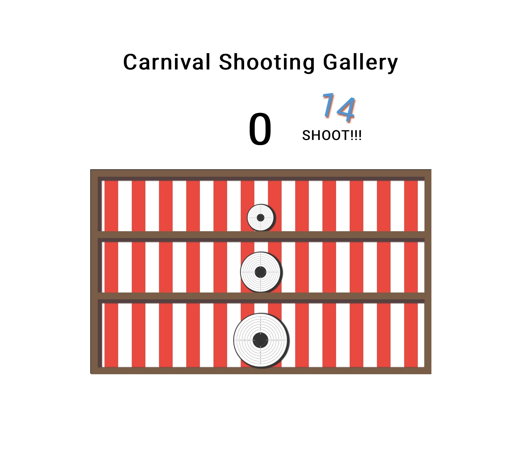
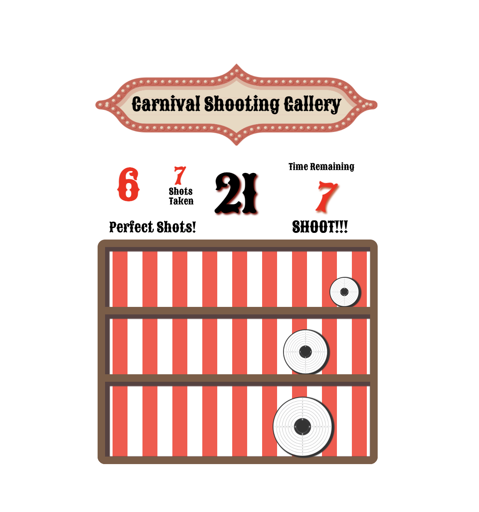

<h1 align="center">Greg Goodrem Milestone Project 2</h1>
<h2 align='center'>Carnival Shooting Gallery (Javascript game)</h2>
 

This project is designed as a shooting gallery game for fun. This game is constructed with my correct knowledge level of HTML, CSS and Javascript. The goal of the game is to shoot the targets as quickly as you can during the 20 second time limit.

The live website can be found here.

[View the live project here.](https://codegreg1.github.io/milestone_project2/)

<h2 align="center"></h2>

## Contents

-   ### [User Experience](#ux)
-   ### [Game Research](#research)
-   ### [Design Process](#design)
-   ### [Wireframe Outlines](#wireframes)
-   ### [Responsive Design Features](#responsive)
-   ### [Future Features](#future)
-   ### [Technologies used](#tech)
-   ### [Frameworks, Libraries & Programs Used](#frameworks)
-   ### [Credits](#credit)
-   ### [Testing & links](#testing)
-   ### [Errors and Bugs](#errors)
-   ### [Journey through Project](#journey)
-   ### [Personal Conclusion](#conclusion)

 
<a name='ux'/>

## User Experience (UX and UI) 

-   ### First Time Visitor Goals
    - As a first time user I need them to understand how to get the game started and the general rules of the game. 
        
    - As a first time user I need them to understand how to shoot a target to take them down.

    - As a first time user I need them to easily play the game through responsive design of the shooting gallery.

    - As a first time user I need them to realise how the scoring works so they can beat their previous score next time they play. 

-   ### Returning Visitor Goals

    - As a Returning Visitor, I want them to be competitive with themselves and try and get the best score possible. 
    
     
    <a name='research'/>

##  Game Research  
    
I wanted to explore a retro shooting style game which would be very unique. I loved playing games like this myself games such as Time-crisis back in the 1990's. I gathered more inspiration for this game from shoot'em ups and classic retro games like duck hunt, space invaders and asteroids.
    I played several of these types of games both online and through a retro gaming console to help develop an idea.
    
-   ### Research Analysis
    I thought although it would be great to write games such as space invaders or asteroids in a more code along type of learning for this project, I wanted to put my own spin on a shooting game.
    
    I hadn't seen a game like the one I designed on any of the retro sites or comsoles. 
    I thought to keep it child friendly I would use a carnival shooting style instead of a more military style shooting experience with enemy targets.
    Although this idea could develop into more development of the game.
    
     
    

## Design 

-   The design is suppose to mimic a carnival stall where you would shoot at the targets and win a prize!

    ### Colour Scheme
    -   The two main colours used are Red, Black and White as I feel these fit with the general aesthetics of the theme.
   
    ### Typography
    -   I've used two fonts in this game.
    'Sancreek' has been used to give the text a more fun carnival feel although it's quite a complicated design so mainly used as titles and sub titles.
    'Roboto' has also been used to give the instructions a clean and clear font which should make it easy to read.

    ### Imagery
    -   Two pictures have been used I've created and edited both in canva.
    The target design was made to show a realistic visual for a target with the rings showing a potential score. 
    Later during my game development I thought I would keep the design however lose the scoring so it would be less complicated for the player only having to focus on the centre target and the outer white rings.
    The carnival background header was created to give the game some sort of carnival feel.
    
     
    <a name='wireframes'/>

## Wireframes 

-   Initial/Instruction Screen Wireframe - [View](https://codegreg1.github.io/milestone_project2/assets/media/projectWireframeInitialScreen.png)
-   Game Display Screen Wireframe - [View](https://codegreg1.github.io/milestone_project2/assets/media/projectWireframeGameScreen.png)
-   Score Screen Wireframe - [View](https://codegreg1.github.io/milestone_project2/assets/media/projectWireframeScoreScreen.png)

 
<a name='responsive'/>

## Responsive Design Features 
- Game Designed completely independently of tutorials or code along type projects.
- Game is designed as an interactive shooting gallery.
- Game is playable on all platforms although mobile will achieve a higher score due to more digits able to hit more targets.
- The game keeps score of the Total score, Perfect shots, also a shoots taken tally.
- The game has an animated count down clock and also animated target when knocked down.
- The game also resets the target within the different levels length as soon as the previous target disappears.

         
<a name='future'/>

## Future Features 
-   Once a website is established I could create a highscore section which also differenciates between mobile and desktop players.    
-   Different types of level themes.
-   Moving targets either left or right to make it more challenging.

 
<a name='tech'/>

## Technologies used 
-   [HTML5](https://en.wikipedia.org/wiki/HTML5)
-   [CSS3](https://en.wikipedia.org/wiki/Cascading_Style_Sheets)
-   [Javascript](https://en.wikipedia.org/wiki/javascript)

 
<a name='frameworks'/>

## Frameworks, Libraries & Programs Used 

- [Google Fonts:](https://fonts.google.com/)     
    - Google fonts were used to import the 'Roboto' font into the style.css file which is used on all pages throughout the project.
- [Font Awesome:](https://fontawesome.com/)
    - Font Awesome was used on all pages throughout the website to add icons for aesthetic and UX purposes.
- [Git](https://git-scm.com/)
    - Git was used for version control by utilizing the VS Code terminal to commit to Git and Push to GitHub.
- [Visual Studio Code](https://code.visualstudio.com)
    - I used VS Code as I have found it quite easy to use and also enables me to automatically have a hard copy of each file on my laptop
- [GitHub:](https://github.com/)
    - GitHub is used to store the projects code after being pushed from Git.
- [Balsamiq:](https://balsamiq.com/)
    - Balsamiq was used to create the wireframes during the design process.
- [Howler](https://howlerjs.com)
    - I used Howler to correct the issue I had with the sound effects not playing correctly.
    
     
    <a name='credit'/>

## Credits

I was inspired by some of the course material in the 50 javascript projects in 50 days course I did to help my understanding of Javascript for some of the elements of the game. The bullet holes was inspired by a ripple button click on the course which I rewrote and adapted to how I wanted it to work. Also the animated countdown timer I wrote with a softer movement of the numbers rotating round and then disappearing.

 
<a name='testing'/>

## Testing 

The W3C Markup Validator and W3C CSS Validator Services were used to validate every page of the project to ensure there were no syntax errors in the project.

- [W3C Markup Validator](https://validator.w3.org/nu/?doc=https%3A%2F%2Fcodegreg1.github.io%2Fmilestone_project2%2F) - Results - No Errors or Warnings
- [W3C CSS Validator](https://jigsaw.w3.org/css-validator/validator?uri=https%3A%2F%2Fcodegreg1.github.io%2Fmilestone_1_greg_goodrem%2Fassets%2Fcss%2Fstyle.css&profile=css3svg&usermedium=all&warning=1&vextwarning=&lang=en) - Results No Errors
- [Lighthouse Report Mobile](https://codegreg1.github.io/milestone_project2/assets/media/Lighthouse/lighthouse_mobile_report.html) - All in the green 2 at 100%
- [Lighthouse Report Desktop](https://codegreg1.github.io/milestone_project2/assets/media/Lighthouse/lighthouse_desktop_report.html) -All in the green 3 at 100%
- [Wave Report](https://wave.webaim.org/report#/https://codegreg1.github.io/milestone_project2/) - There are alerts that relate to possible headings however these are not headings.
-   [ESLint](https://eslint.org/play/#eyJ0ZXh0IjoiLy9FbGVtZW50cyByZWxhdGVkIHRvIHRoZSBiYXNpYyB2aXN1YWwgc2V0dXAgYW5kIGludGVyYWN0aW9uXG4vKmdsb2JhbCBkb2N1bWVudCBIb3dsIGNvbnNvbGUgc2V0VGltZW91dCBtb2R1bGUgKi9cbmNvbnN0IE5VTUJFUlMgPSBkb2N1bWVudC5nZXRFbGVtZW50QnlJZCgnbnVtYmVycycpO1xuY29uc3QgRklOQUxfU0NPUkUgPSBkb2N1bWVudC5nZXRFbGVtZW50QnlJZCgnc2NvcmUnKTtcbmNvbnN0IFBFUkZFQ1RfU0NPUkUgPSBkb2N1bWVudC5nZXRFbGVtZW50QnlJZCgncGVyZmVjdFNjb3JlJyk7XG5jb25zdCBTQ09SRV9TQ1JFRU4gPSBkb2N1bWVudC5nZXRFbGVtZW50QnlJZCgnc2NvcmVzY3JlZW4nKTtcbmNvbnN0IFBSRVNUQVJUID0gZG9jdW1lbnQuZ2V0RWxlbWVudEJ5SWQoJ3ByZXN0YXJ0Jyk7XG5jb25zdCBHQU1FX1NDT1JFID0gZG9jdW1lbnQuZ2V0RWxlbWVudEJ5SWQoJ2dhbWVTY29yZScpO1xuY29uc3QgTlVNUyA9IGRvY3VtZW50LnF1ZXJ5U2VsZWN0b3JBbGwoJy5udW1zIHNwYW4nKTtcbmNvbnN0IENPVU5URVIgPSBkb2N1bWVudC5xdWVyeVNlbGVjdG9yKCcuY291bnRlcicpO1xuY29uc3QgUkVQTEFZID0gZG9jdW1lbnQucXVlcnlTZWxlY3RvcignI3JlcGxheScpO1xuY29uc3QgVEFSR0VUUyA9IGRvY3VtZW50LnF1ZXJ5U2VsZWN0b3JBbGwoJy50YXJnZXQnKTtcbmNvbnN0IFRBUkdFVF8xID0gZG9jdW1lbnQuZ2V0RWxlbWVudEJ5SWQoJ3RhcmdldG9uZScpO1xuY29uc3QgVEFSR0VUXzIgPSBkb2N1bWVudC5nZXRFbGVtZW50QnlJZCgndGFyZ2V0dHdvJyk7XG5jb25zdCBUQVJHRVRfMyA9IGRvY3VtZW50LmdldEVsZW1lbnRCeUlkKCd0YXJnZXR0aHJlZScpO1xuY29uc3QgTUlTU0VEID0gZG9jdW1lbnQucXVlcnlTZWxlY3RvcignLmNvbnRhaW5lcicpO1xuY29uc3QgQ0VOVEVSUyA9IGRvY3VtZW50LnF1ZXJ5U2VsZWN0b3JBbGwoJy5jZW50ZXJ0YXJnZXQnKTtcbmNvbnN0IFBFUkZFQ1QgPSBkb2N1bWVudC5xdWVyeVNlbGVjdG9yKCcucGVyZmVjdCcpO1xuY29uc3QgU0hPVF9UQUxMWV9JRCA9IGRvY3VtZW50LnF1ZXJ5U2VsZWN0b3IoJyNzaG90VGFsbHlJRCcpO1xuY29uc3QgU0hPVF9UQUxMWV9DVVJSRU5UID0gZG9jdW1lbnQucXVlcnlTZWxlY3RvcignI3Nob3RUYWxseUN1cnJlbnQnKTtcbmNvbnN0IFBFUkZFQ1RfVEFMTFlfSUQgPSBkb2N1bWVudC5xdWVyeVNlbGVjdG9yKCcjcGVyZmVjdFRhbGx5Jyk7XG5jb25zdCBUQVJHRVRfVEFMTFlfSUQgPSBkb2N1bWVudC5xdWVyeVNlbGVjdG9yKCcjdGFyZ2V0VGFsbHknKTtcbmNvbnN0IEJVTExFVF9IT0xFUyA9IGRvY3VtZW50LnF1ZXJ5U2VsZWN0b3JBbGwoJy5yaXBwbGUnKTtcbmNvbnN0IElOU1RSVUNUSU9OX1NUQVJUID0gZG9jdW1lbnQuZ2V0RWxlbWVudEJ5SWQoJ2luc3RydWN0aW9uU3RhcnQnKTtcbi8vQWN0aXZlIHZhcmlhYmxlcyB0aHJvdWdob3V0IGdhbWVcbmxldCBwb3NpdGlvbk51bSA9IDU7XG5sZXQgcGVyZmVjdFRhbGx5ID0gMDtcbmxldCBzaG90VGFsbHkgPSAwO1xubGV0IHRhcmdldFRhbGx5ID0gMDtcblxuLyogVGhlc2UgYXJlIHRoZSBzb3VuZCBlZmZlY3RzIHRoYXQgSSdtIHVzaW5nIGluIGNvbmp1Y3Rpb24gd2l0aCBIb3dsZXIganMgd2hpY2ggZW5hYmxlc1xubWUgdG8gaGF2ZSAyIGRpZmZlcmVudCB0eXBlcyBvZiBzb3VuZCBlZmZlY3QgMSBmb3IgZmlyaW5nIGFuZCBoaXR0aW5nIGEgdGFyZ2V0IGFuZCB0aGUgXG5vdGhlciBmb3IgbWlzc2luZyB0aGUgdGFyZ2V0ICovXG52YXIgc2Z4ID0ge1xuICAgIHNob3Q6IG5ldyBIb3dsKHtcbiAgICBzcmM6IFtcImh0dHBzOi8vY29kZWdyZWcxLmdpdGh1Yi5pby9taWxlc3RvbmVfcHJvamVjdDIvZ3Vuc2hvcnQubXAzXCJdLFxuICAgIGF1dG9wbGF5OiB0cnVlXG59KSxcbiAgICBtaXNzOiBuZXcgSG93bCh7XG4gICAgc3JjOiBbXCJodHRwczovL2NvZGVncmVnMS5naXRodWIuaW8vbWlsZXN0b25lX3Byb2plY3QyL3JpY29jaGV0Lm1wM1wiXSxcbiAgICBhdXRvcGxheTp0cnVlXG59KX07XG5cbi8qIFRoZSBldmVudCBsaXN0ZW5lcnMgbGlzdGVkIGhlcmUgYXJlIHVzZWQgZm9yIHRoZSBzdGFydGluZywgcmVwbGF5aW5nIG9mIHRoZSBtYWluIGdhbWVcbmFuZCBhbHNvIHRoZSBkaWZmZXJlbnQgZWZmZWN0cyBvbiB0YXJnZXRzOiBcbiAgICBUYXJnZXQxIGJlaW5nIGhpdFxuICAgIFRhcmdldDIgYmVpbmcgaGl0XG4gICAgVGFyZ2V0MyBiZWluZyBoaXRcbiAgICBUYXJnZXQgbWlzc2VkXG4gICAgQ2VudGVyL1BlcmZlY3QgaGl0IGlzIGFjaGlldmVkIG9uIGFueSBsZXZlbFxuICAgIGFuZCBmaW5hbGx5IHRoZSBidWxsZXQgaG9sZSBlZmZlY3Qgb24gbWlzc2VkIHRhcmdldHNcbiovXG5QUkVTVEFSVC5hZGRFdmVudExpc3RlbmVyKCdjbGljaycscnVuR2FtZSk7XG5cblJFUExBWS5hZGRFdmVudExpc3RlbmVyKCdjbGljaycsIHJlcGxheSk7XG5cbklOU1RSVUNUSU9OX1NUQVJULmFkZEV2ZW50TGlzdGVuZXIoJ2NsaWNrJywgaW5zdHJ1Y3Rpb25TdGFydCk7XG5cbk1JU1NFRC5hZGRFdmVudExpc3RlbmVyKCdjbGljaycsIG1pc3NlZFNob3QpO1xuXG5UQVJHRVRfMS5hZGRFdmVudExpc3RlbmVyKCdjbGljaycsKCk9PiB7XG4gICAgcG9zaXRpb25OdW0gPSAyNjg7XG4gICAgaW5jcmVtZW50U2NvcmUoMSk7XG4gICAgc2hvdFVwZGF0ZSgpO31cbik7XG5UQVJHRVRfMi5hZGRFdmVudExpc3RlbmVyKCdjbGljaycsKCk9PiB7XG4gICAgcG9zaXRpb25OdW0gPSAyODg7XG4gICAgaW5jcmVtZW50U2NvcmUoMik7XG4gICAgc2hvdFVwZGF0ZSgpO31cbik7XG5UQVJHRVRfMy5hZGRFdmVudExpc3RlbmVyKCdjbGljaycsKCk9PiB7XG4gICAgcG9zaXRpb25OdW0gPSAzMDg7XG4gICAgc2hvdFVwZGF0ZSgpO1xuICAgIGluY3JlbWVudFNjb3JlKDMpO1xufSk7XG4vKiBUaGVzZSBmb3IgbG9vcHMgYXJlIGZvciB3aGVuIHRhcmdldHMgZ2V0IHRhcHBlZC9jbGlja2VkIGFuZCBhIFxuZmlyaW5nIHNvdW5kIGlzIHRvIGJlIGluaXRpYXRlZC4gVGhlIHN0b3BQcm9wYWdhdGlvbiBtYWtlcyBzdXJlIGl0XG5kb2Vzbid0IHN0YXJ0IHRoZSBtaXNzZWQgc2hvdCBldmVudCBsaXN0ZW5lci4gXG5UaGUgc2Vjb25kIGlzIGEgZm9yIGxvb3AgZm9yIHRoZSBkZXRlY3Rpb24gb2YgYSBwZXJmZWN0IHNob3QgYmVpbmcgbWFkZS5cblRoZSB0aGlyZCBpcyB0aGUgdmlzdWFsaXNhdGlvbiBvZiBhIHNob3QgYmVpbmcgbWFkZSBvbiB0aGUgY29udGFpbmVyLiovXG5cblRBUkdFVFMuZm9yRWFjaCgodGFyZ2V0KT0+e1xuICAgIHRhcmdldC5hZGRFdmVudExpc3RlbmVyKCdjbGljaycsIGZ1bmN0aW9uKGUpIHtcbiAgICAgICAgdGFyZ2V0LmNsYXNzTGlzdC50b2dnbGUoJ2FjdGl2ZScpO1xuICAgICAgICBzZnguc2hvdC5wbGF5KCk7XG4gICAgICAgIHRhcmdldFRhbGx5Kys7XG4gICAgICAgIGUuc3RvcFByb3BhZ2F0aW9uKCk7XG4gICAgICAgIGNvbnNvbGUubG9nKCdUYXJnZXQgY2xpY2tlZCcpO1xuICAgICAgICBzZXRUaW1lb3V0KG5ld1Bvc2l0aW9uLCAxMDApO30pO1xufVxuKTtcblxuQ0VOVEVSUy5mb3JFYWNoKChjZW50ZXIpPT57XG4gICAgY2VudGVyLmFkZEV2ZW50TGlzdGVuZXIoJ2NsaWNrJywoKT0+IHtcbiAgICAgICAgaW5jcmVtZW50U2NvcmUoMSk7XG4gICAgICAgIHBlcmZlY3RUYWxseSsrO1xuICAgICAgICBpbmNyZW1lbnRQZXJmZWN0U2NvcmUoKTt9KTtcbn1cbik7XG5cbkJVTExFVF9IT0xFUy5mb3JFYWNoKGhvbGUgPT4ge1xuICAgIGhvbGUuYWRkRXZlbnRMaXN0ZW5lcignY2xpY2snLCBmdW5jdGlvbiAoZSkge1xuICAgIGNvbnN0IFRBUkdFVF9PRkZTRVQgPSBwYXJzZUludCg0KTtcbiAgICBjb25zdCBYID0gZS5jbGllbnRYIC0gVEFSR0VUX09GRlNFVDtcbiAgICBjb25zdCBZID0gZS5jbGllbnRZIC0gVEFSR0VUX09GRlNFVDtcbiAgICBjb25zdCBjaXJjbGUgPSBkb2N1bWVudC5jcmVhdGVFbGVtZW50KCdzcGFuJyk7XG4gICAgY2lyY2xlLmNsYXNzTGlzdC5hZGQoJ2NpcmNsZScpO1xuICAgIGNpcmNsZS5zdHlsZS50b3AgPSBZICsgJ3B4JztcbiAgICBjaXJjbGUuc3R5bGUubGVmdCA9IFggKyAncHgnO1xuICAgIHRoaXMuYXBwZW5kQ2hpbGQoY2lyY2xlKTtcbiAgICBjb25zb2xlLmxvZyhYLFkpO1xuICAgIHNob3RVcGRhdGUoKTtcbiAgICBzZXRUaW1lb3V0KCgpID0+IGNpcmNsZS5yZW1vdmUoKSwgMjAwKTtcbn0pO31cbik7XG5cbi8vVGhpcyBwbGF5cyBhIHJpY29jaGV0IHNvdW5kIGV2ZXJ5dGltZSBhIHNob3QgaXMgbm90IGhpdHRpbmcgYSB0YXJnZXRcbmZ1bmN0aW9uIG1pc3NlZFNob3QoKXtcbiAgICBzZngubWlzcy5wbGF5KCk7XG4gICAgc2Z4Lm1pc3Mudm9sdW1lKDAuNik7XG59XG5cbi8vVGhpcyB3b3JrcyBpbiBjb25qdW5jdGlvbiB3aXRoIHRoZSB0YXJnZXQgYmVpbmcgaGl0IGFuZCB0aGVuIHJlc2V0IGludG8gYSBuZXcgXG4vL3Bvc2l0aW9uIGFsb25nIGl0cyBob3Jpem9udGFsIGF4aXMgZGVwZW5kaW5nIG9uIHdoaWNoIGxldmVsIHRhcmdldCBoYXMgYmVlbiBzdHJ1Y2sgXG5mdW5jdGlvbiBuZXdQb3NpdGlvbigpe1xuICAgIGxldCBhY3RpdmVUYXJnZXQgPSBkb2N1bWVudC5xdWVyeVNlbGVjdG9yKCcudGFyZ2V0LmFjdGl2ZScpO1xuICAgIGFjdGl2ZVRhcmdldC5zdHlsZS5sZWZ0ID0gYCR7KE1hdGguZmxvb3IoTWF0aC5yYW5kb20oKSAqIHBvc2l0aW9uTnVtKSArIDEpfXB4YDtcbiAgICBhY3RpdmVUYXJnZXQuY2xhc3NMaXN0LnRvZ2dsZSgnYWN0aXZlJyk7XG59XG5cbi8qIEJlbG93IGFyZSB0aGUgdHdvIGRpZmZlcmVudCBpbmNyZW1lbnRhdGlvbiBvZiBzY29yZXMuIFRoZSBwZXJmZWN0IHNjb3JlIGlzIHZlcnkgYmFzaWNcbmJ1dCB0aGUgZ2VuZXJhbCBpbmNyZW1lbnRTY29yZSBpbmNvcnBvcmF0ZXMgbnVtYmVycyBiZWluZyBwYXNzZWQgaW50byBpdCBmcm9tIHdoaWNoZXZlciBcbmxldmVsIHRoZSB0YXJnZXRzIGFyZSBoaXQuICovXG5mdW5jdGlvbiBpbmNyZW1lbnRQZXJmZWN0U2NvcmUoKXtcbiAgICBsZXQgb2xkU2NvcmUgPSBwYXJzZUludChkb2N1bWVudC5nZXRFbGVtZW50QnlJZChcInBlcmZlY3RTY29yZVwiKS5pbm5lclRleHQpO1xuICAgIGRvY3VtZW50LmdldEVsZW1lbnRCeUlkKFwicGVyZmVjdFNjb3JlXCIpLmlubmVyVGV4dCA9ICsrb2xkU2NvcmU7XG59XG5cbmZ1bmN0aW9uIGluY3JlbWVudFNjb3JlKHgpe1xuICAgIGlmICh4ID09PSAxKSB7eCA9IDE7XG4gICAgfSBlbHNlIGlmICh4ID09PSAyKSB7eCA9IDI7XG4gICAgfSBlbHNlIHt4ID0gMztcbiAgICB9XG4gICAgbGV0IG9sZFNjb3JlID0gcGFyc2VJbnQoZG9jdW1lbnQuZ2V0RWxlbWVudEJ5SWQoXCJzY29yZVwiKS5pbm5lclRleHQpO1xuICAgIGRvY3VtZW50LmdldEVsZW1lbnRCeUlkKFwic2NvcmVcIikuaW5uZXJUZXh0ID0gb2xkU2NvcmUgKyB4O1xufVxuXG4vKiBCZWxvdyBhcmUgdGhlIG1haW4gZ2FtZSBzdGFydGluZyBhbmQgcmVzdGFydGluZyBmdW5jdGlvbnMuIFxucnVuR2FtZSgpIGlzIHRoZSBpbml0aWFsIGZ1bmN0aW9uIHJlYWR5IHRvIGJlIHN0YXJ0ZWQgYXQgdGhlIHN0YXJ0IG9mIHRoZSBwYWdlIGxvYWQgXG5hbmQgcnVucyBvdGhlciBmdW5jdGlvbnMgZm9yIHRoZSBnYW1lIHRvIGJlIGFjdGl2ZS5cbnJlc2V0RE9NKCkgaXMgdXNlZCB0byByZXNldCB0aGUgRE9NIGFuZCBhbHNvIHRoZSBjb3VudGRvd24gdGltZXIuXG5yZXBsYXkoKSBpcyB1c2VkIGFmdGVyIHRoZSBnYW1lIGhhcyBiZWVuIHJ1biBzbyB0aGF0IHRoZSBzY29yZXMgY2FuIGdvIGJhY2sgdG8gemVybyBcbmFuZCBhbHNvIHRoZSBET00gYmVpbmcgcmVzZXQgdXBvbiB0aGUgbmV4dCBnYW1lIGxvYWQuXG5pbnN0cnVjdGlvblN0YXJ0KCkgaXMgYW4gYWx0ZXJuYXRpdmUgb3B0aW9uIHRvIHJlcGxheSgpIGluY2FzZSBhbnlvbmUgcGxheWluZyBuZWVkcyB0byBcbnJldmlldyB0aGUgaW5zdHJ1Y3Rpb25zIGFnYWluIGhvd2V2ZXIgdGhpbmdzIHN0aWxsIG5lZWQgdG8gYmUgcmVzZXQuXG4qL1xuZnVuY3Rpb24gcnVuR2FtZSgpIHtcbiAgICBwZXJmZWN0VGFsbHkgPSAwO1xuICAgIHNob3RUYWxseSA9IDA7XG4gICAgU0hPVF9UQUxMWV9DVVJSRU5ULmlubmVyVGV4dCA9IHNob3RUYWxseTtcbiAgICB0YXJnZXRUYWxseSA9IDA7XG4gICAgcmVzZXRET00oKTtcbiAgICBzdGFydFNjb3JlKCk7XG4gICAgY29uc3QgSDQgPSBkb2N1bWVudC5xdWVyeVNlbGVjdG9yKCdoNCcpO1xuICAgIEZJTkFMX1NDT1JFLnN0eWxlLmZvbnRTaXplID0gJzY1cHgnO1xuICAgIHJ1bkFuaW1hdGlvbigpO1xuICAgIEg0LmlubmVyVGV4dCA9ICdTSE9PVCEhISc7XG4gICAgTlVNQkVSUy5jbGFzc0xpc3QuYWRkKCdpbicpO1xuICAgIE5VTUJFUlMuY2xhc3NMaXN0LnJlbW92ZSgnaW4nKTtcbiAgICBOVU1CRVJTLmNsYXNzTGlzdC5hZGQoJ291dCcpO1xufVxuXG5mdW5jdGlvbiByZXNldERPTSAoKSB7XG4gICAgQ09VTlRFUi5jbGFzc0xpc3QucmVtb3ZlKCdoaWRlJyk7XG4gICAgQ09VTlRFUi5jbGFzc0xpc3QuYWRkKCdzaG93Jyk7XG4gICAgTlVNUy5mb3JFYWNoKChudW0pID0+IHtcbiAgICAgICAgbnVtLmNsYXNzTGlzdC52YWx1ZSA9ICcnO30pO1xuICAgIE5VTVNbMF0uY2xhc3NMaXN0LmFkZCgnaW4nKTtcbn1cblxuZnVuY3Rpb24gcmVwbGF5KCl7XG4gICAgRklOQUxfU0NPUkUuaW5uZXJUZXh0ID0gJzAnO1xuICAgIFBFUkZFQ1RfU0NPUkUuaW5uZXJUZXh0ID0gJzAnO1xuICAgIFNIT1RfVEFMTFlfQ1VSUkVOVC5pbm5lclRleHQgPSAnMCc7XG4gICAgU0NPUkVfU0NSRUVOLmNsYXNzTGlzdC5hZGQoJ2hpZGRlbnNjb3JlJyk7XG4gICAgU0NPUkVfU0NSRUVOLmNsYXNzTGlzdC5yZW1vdmUoJ3Zpc2libGUnKTtcbiAgICBQRVJGRUNUX1NDT1JFLmNsYXNzTGlzdC5yZW1vdmUoJ2hpZGRlbnNjb3JlJyk7XG4gICAgUEVSRkVDVC5jbGFzc0xpc3QucmVtb3ZlKCdoaWRkZW5zY29yZScpO1xuICAgIHJ1bkdhbWUoKTtcbn1cblxuZnVuY3Rpb24gaW5zdHJ1Y3Rpb25TdGFydCgpe1xuICAgIEZJTkFMX1NDT1JFLmlubmVyVGV4dCA9ICcwJztcbiAgICBQRVJGRUNUX1NDT1JFLmlubmVyVGV4dCA9ICcwJztcbiAgICBTQ09SRV9TQ1JFRU4uY2xhc3NMaXN0LmFkZCgnaGlkZGVuc2NvcmUnKTtcbiAgICBTQ09SRV9TQ1JFRU4uY2xhc3NMaXN0LnJlbW92ZSgndmlzaWJsZScpO1xuICAgIFBFUkZFQ1RfU0NPUkUuY2xhc3NMaXN0LnJlbW92ZSgnaGlkZGVuc2NvcmUnKTtcbiAgICBQRVJGRUNULmNsYXNzTGlzdC5yZW1vdmUoJ2hpZGRlbnNjb3JlJyk7XG4gICAgUFJFU1RBUlQuY2xhc3NMaXN0LnJlbW92ZSgnaGlkZGVuc2NvcmUnKTtcbiAgICBQUkVTVEFSVC5jbGFzc0xpc3QuYWRkKCd2aXNpYmxlJyk7XG59XG5cbi8qIHNob3RVcGRhdGUoKSB1cGRhdGVzIHRoZSBzaG90IHRhbGx5IGluIHRoZSBnYW1lIGFuZCBydW5BbmltYXRpb24oKSBhbGxvd3NcbmZvciB0aGUgc2NvcmUgdG8gYmUgYW5pbWF0ZWQgdXNpbmcgdGhlIENTUyB0cmFuc2Zvcm1hdGlvbnMgYW5kIGNsYXNzZXMgc21vb3RobHlcbm9uY2UgdGhlIGdhbWUgaGFzIGJlZ3VuLlxuKi9cbmZ1bmN0aW9uIHNob3RVcGRhdGUoKXtcbiAgICBzaG90VGFsbHkrKztcbiAgICBTSE9UX1RBTExZX0NVUlJFTlQuaW5uZXJUZXh0ID0gc2hvdFRhbGx5O1xufVxuXG5mdW5jdGlvbiBydW5BbmltYXRpb24oKSB7XG4gICAgTlVNUy5mb3JFYWNoKChudW0saWR4KSA9PiB7XG4gICAgICAgIGxldCBuZXh0VG9MYXN0ID0gTlVNUy5sZW5ndGggLSAxO1xuICAgICAgICBudW0uYWRkRXZlbnRMaXN0ZW5lcignYW5pbWF0aW9uZW5kJywgKGUpID0+IHtcbiAgICAgICAgICAgIGlmKGUuYW5pbWF0aW9uTmFtZSA9PT0gJ2dvSW4nICYmIGlkeCAhPT0gbmV4dFRvTGFzdCkge1xuICAgICAgICAgICAgICAgIG51bS5jbGFzc0xpc3QucmVtb3ZlKCdpbicpO1xuICAgICAgICAgICAgICAgIG51bS5jbGFzc0xpc3QuYWRkKCdvdXQnKTtcbiAgICAgICAgICAgIH0gZWxzZSBpZiAoZS5hbmltYXRpb25OYW1lID09PSAnZ29PdXQnICYmIG51bS5uZXh0RWxlbWVudFNpYmxpbmcpIHtcbiAgICAgICAgICAgICAgICBudW0ubmV4dEVsZW1lbnRTaWJsaW5nLmNsYXNzTGlzdC5hZGQoJ2luJyk7XG4gICAgICAgICAgICB9IGVsc2Uge1xuICAgICAgICAgICAgICAgIENPVU5URVIuY2xhc3NMaXN0LmFkZCgnaGlkZScpO319KTt9KTtcbn1cblxuLyogVGhlIGZ1bmN0aW9ucyBiZWxvdyByZWxhdGUgdG8gdGhlIHNjb3Jpbmcgb2YgdGhlIGdhbWUgb25lIHN0YXJ0cyB0aGUgc2NvcmUgKHN0YXJ0U2NvcmUpXG5hbmQgYWxzbyBjb3VudGRvd24gdGltZXIuXG5zdG9wU2NvcmUoKSBvYnZpb3VzbHkgc3RvcHMgdGhlIGdhbWUgYnkgcmV2ZWFsaW5nIHRoZSByZXN1bHRzLlxuYWxsU2NvcmVzKCkgdmlzdWFsbHkgZGlzcGxheXMgdGhlIHNjb3JlcyBhY2hpZXZlZCBpbiB0aGUgZ2FtZS5cbiovXG5mdW5jdGlvbiBzdGFydFNjb3JlICgpe1xuICAgIFBSRVNUQVJULmNsYXNzTGlzdC5hZGQoJ2hpZGRlbnNjb3JlJyk7XG4gICAgUFJFU1RBUlQuY2xhc3NMaXN0LnJlbW92ZSgndmlzaWJsZScpO1xuICAgIHNldFRpbWVvdXQoc3RvcFNjb3JlLCAyMDAwMCk7XG59XG5cbmZ1bmN0aW9uIHN0b3BTY29yZSAoKSB7XG4gICAgRklOQUxfU0NPUkUuaW5uZXJUZXh0ID0gYCR7cGFyc2VJbnQoRklOQUxfU0NPUkUuaW5uZXJUZXh0KX0gVG9wIFNjb3JlIWA7XG4gICAgU0NPUkVfU0NSRUVOLmNsYXNzTGlzdC5yZW1vdmUoJ2hpZGRlbnNjb3JlJyk7XG4gICAgU0NPUkVfU0NSRUVOLmNsYXNzTGlzdC5hZGQoJ3Zpc2libGUnKTtcbiAgICBQRVJGRUNUX1NDT1JFLmNsYXNzTGlzdC5hZGQoJ2hpZGRlbnNjb3JlJyk7XG4gICAgUEVSRkVDVC5jbGFzc0xpc3QuYWRkKCdoaWRkZW5zY29yZScpO1xuICAgIEdBTUVfU0NPUkUuaW5uZXJUZXh0ID0gRklOQUxfU0NPUkUuaW5uZXJUZXh0O1xuICAgIEZJTkFMX1NDT1JFLnN0eWxlLmZvbnRTaXplID0gJzM1cHgnO1xuICAgIE5VTUJFUlMuY2xhc3NMaXN0LnJlbW92ZSgnb3V0Jyk7XG4gICAgYWxsU2NvcmVzKCk7XG59XG5cbmZ1bmN0aW9uIGFsbFNjb3JlcyAoKXsgXG4gICAgU0hPVF9UQUxMWV9JRC5pbm5lckhUTUwgPSBgJHtzaG90VGFsbHl9IFNob3RzIFRha2VuYDtcbiAgICBpZihzaG90VGFsbHkgPT09IDApe1xuICAgICAgICBzaG90VGFsbHkrKzt9XG4gICAgbGV0IHBlcmZlY3RQZXJjZW50YWdlID0gTWF0aC5mbG9vcihwZXJmZWN0VGFsbHkvc2hvdFRhbGx5KjEwMCk7XG4gICAgVEFSR0VUX1RBTExZX0lELmlubmVySFRNTCA9IGAke3RhcmdldFRhbGx5fSBUYXJnZXRzIEhpdGA7XG4gICAgUEVSRkVDVF9UQUxMWV9JRC5pbm5lckhUTUwgPSBgJHtwZXJmZWN0UGVyY2VudGFnZX0lIFBlcmZlY3QgU2hvdHNgO1xufVxuXG5tb2R1bGUuZXhwb3J0cyA9IHsgaW5jcmVtZW50U2NvcmUgfSIsIm9wdGlvbnMiOnsicGFyc2VyT3B0aW9ucyI6eyJlY21hVmVyc2lvbiI6ImxhdGVzdCIsInNvdXJjZVR5cGUiOiJzY3JpcHQiLCJlY21hRmVhdHVyZXMiOnt9fSwicnVsZXMiOnsiY29uc3RydWN0b3Itc3VwZXIiOlsiZXJyb3IiXSwiZm9yLWRpcmVjdGlvbiI6WyJlcnJvciJdLCJnZXR0ZXItcmV0dXJuIjpbImVycm9yIl0sIm5vLWFzeW5jLXByb21pc2UtZXhlY3V0b3IiOlsiZXJyb3IiXSwibm8tY2FzZS1kZWNsYXJhdGlvbnMiOlsiZXJyb3IiXSwibm8tY2xhc3MtYXNzaWduIjpbImVycm9yIl0sIm5vLWNvbXBhcmUtbmVnLXplcm8iOlsiZXJyb3IiXSwibm8tY29uZC1hc3NpZ24iOlsiZXJyb3IiXSwibm8tY29uc3QtYXNzaWduIjpbImVycm9yIl0sIm5vLWNvbnN0YW50LWNvbmRpdGlvbiI6WyJlcnJvciJdLCJuby1jb250cm9sLXJlZ2V4IjpbImVycm9yIl0sIm5vLWRlYnVnZ2VyIjpbImVycm9yIl0sIm5vLWRlbGV0ZS12YXIiOlsiZXJyb3IiXSwibm8tZHVwZS1hcmdzIjpbImVycm9yIl0sIm5vLWR1cGUtY2xhc3MtbWVtYmVycyI6WyJlcnJvciJdLCJuby1kdXBlLWVsc2UtaWYiOlsiZXJyb3IiXSwibm8tZHVwZS1rZXlzIjpbImVycm9yIl0sIm5vLWR1cGxpY2F0ZS1jYXNlIjpbImVycm9yIl0sIm5vLWVtcHR5IjpbImVycm9yIl0sIm5vLWVtcHR5LWNoYXJhY3Rlci1jbGFzcyI6WyJlcnJvciJdLCJuby1lbXB0eS1wYXR0ZXJuIjpbImVycm9yIl0sIm5vLWV4LWFzc2lnbiI6WyJlcnJvciJdLCJuby1leHRyYS1ib29sZWFuLWNhc3QiOlsiZXJyb3IiXSwibm8tZXh0cmEtc2VtaSI6WyJlcnJvciJdLCJuby1mYWxsdGhyb3VnaCI6WyJlcnJvciJdLCJuby1mdW5jLWFzc2lnbiI6WyJlcnJvciJdLCJuby1nbG9iYWwtYXNzaWduIjpbImVycm9yIl0sIm5vLWltcG9ydC1hc3NpZ24iOlsiZXJyb3IiXSwibm8taW5uZXItZGVjbGFyYXRpb25zIjpbImVycm9yIl0sIm5vLWludmFsaWQtcmVnZXhwIjpbImVycm9yIl0sIm5vLWlycmVndWxhci13aGl0ZXNwYWNlIjpbImVycm9yIl0sIm5vLWxvc3Mtb2YtcHJlY2lzaW9uIjpbImVycm9yIl0sIm5vLW1pc2xlYWRpbmctY2hhcmFjdGVyLWNsYXNzIjpbImVycm9yIl0sIm5vLW1peGVkLXNwYWNlcy1hbmQtdGFicyI6WyJlcnJvciJdLCJuby1uZXctc3ltYm9sIjpbImVycm9yIl0sIm5vLW5vbm9jdGFsLWRlY2ltYWwtZXNjYXBlIjpbImVycm9yIl0sIm5vLW9iai1jYWxscyI6WyJlcnJvciJdLCJuby1vY3RhbCI6WyJlcnJvciJdLCJuby1wcm90b3R5cGUtYnVpbHRpbnMiOlsiZXJyb3IiXSwibm8tcmVkZWNsYXJlIjpbImVycm9yIl0sIm5vLXJlZ2V4LXNwYWNlcyI6WyJlcnJvciJdLCJuby1zZWxmLWFzc2lnbiI6WyJlcnJvciJdLCJuby1zZXR0ZXItcmV0dXJuIjpbImVycm9yIl0sIm5vLXNoYWRvdy1yZXN0cmljdGVkLW5hbWVzIjpbImVycm9yIl0sIm5vLXNwYXJzZS1hcnJheXMiOlsiZXJyb3IiXSwibm8tdGhpcy1iZWZvcmUtc3VwZXIiOlsiZXJyb3IiXSwibm8tdW5kZWYiOlsiZXJyb3IiXSwibm8tdW5leHBlY3RlZC1tdWx0aWxpbmUiOlsiZXJyb3IiXSwibm8tdW5yZWFjaGFibGUiOlsiZXJyb3IiXSwibm8tdW5zYWZlLWZpbmFsbHkiOlsiZXJyb3IiXSwibm8tdW5zYWZlLW5lZ2F0aW9uIjpbImVycm9yIl0sIm5vLXVuc2FmZS1vcHRpb25hbC1jaGFpbmluZyI6WyJlcnJvciJdLCJuby11bnVzZWQtbGFiZWxzIjpbImVycm9yIl0sIm5vLXVudXNlZC12YXJzIjpbImVycm9yIl0sIm5vLXVzZWxlc3MtYmFja3JlZmVyZW5jZSI6WyJlcnJvciJdLCJuby11c2VsZXNzLWNhdGNoIjpbImVycm9yIl0sIm5vLXVzZWxlc3MtZXNjYXBlIjpbImVycm9yIl0sIm5vLXdpdGgiOlsiZXJyb3IiXSwicmVxdWlyZS15aWVsZCI6WyJlcnJvciJdLCJ1c2UtaXNuYW4iOlsiZXJyb3IiXSwidmFsaWQtdHlwZW9mIjpbImVycm9yIl19LCJlbnYiOnsiZXM2Ijp0cnVlfX19) - This is to check the linting of the Javascript code. Again no errors. 

Also I used Jest Testing for automated testing I ran into a couple of problems however I isolated the file and tested seperately. You'll find the isolated function file here:

[Jest Testing Isolated Script Used](https://codegreg1.github.io/milestone_project2/assets/js/script2.js)

Below is the link to the Testing Script which came out with a result of 5 of 5 tests passed. I had to isolate the code because of HowlerJS which I used to have the sound effects running. 

[Jest Test Script](https://codegreg1.github.io/milestone_project2/assets/js/script.test.js)

<h2 align="center"></h2>
As you can see the tests for the incrementation of the score worked as expected after testing and breaking the code then resolving it. The same was true for the Shot Tally increase.

 
<a name='errors'/>

## Errors and Bugs 

-   The biggest area of resistance with the project was trying to get the sound to work in the way intended. I was able to over come this issue with the use of Howler which allowed me to deploy a better user experience with the sound playing on all devices without delays. The problem was initially due to the way Safari among other browsers doesn't allow you to play sounds on a website straight away and requires some sort of interaction with the page first.

-   A second audio issue was that I was going to have the option of a mute button however the global fields for Howler were not able to be imported on this platform (Gitpod) for building or at least I didn't find a way to resolve it.

-   Another bug I have is if the user decides to zoom in on the page and try and hit targets closer this actually distorts the placement of the bullet hole effect. One way in the future to address this is to make the shooting gallery change to the size of the viewing area.

-   I also had a bit of difficulty when initially showing the scores of the perfect scores showing the correct percentages. The problem was when the calculation could sometimes be 0/0 which would come up with a NaN however I was able to correct this by manipulating the numbers so it displayed the correct scores.

 
<a name='journey'/>

## Journey 

#### I feel I have made some big leaps in programming as the project initially started out as it looks below. I was figuring out how to move the targets from one place to another with animation to the final project with a much better game feel to it.

Below is where I started and experimented with javascript.

Below is where it led before I got to my final design

Below is my final design with lots of additions and counters for that true game feel.

 
<a name='conclusion'/>

## Conclusion 

#### I think in reflection over this project there are several things I think went well with how the game works and feels.
#### The positives I believe I have done well is theme the game well and also include cool little extra features such as:
-   Perfect shots (Hitting the middle of the target)
-   Different counters displayed
-   Bullet holes where the shots are taken
-   Sound effects for shots hit and missed

Areas I could improve is having different skins for the game so it could be e.g. zombies popping up or classic figure 11 or 12 targets for military.
